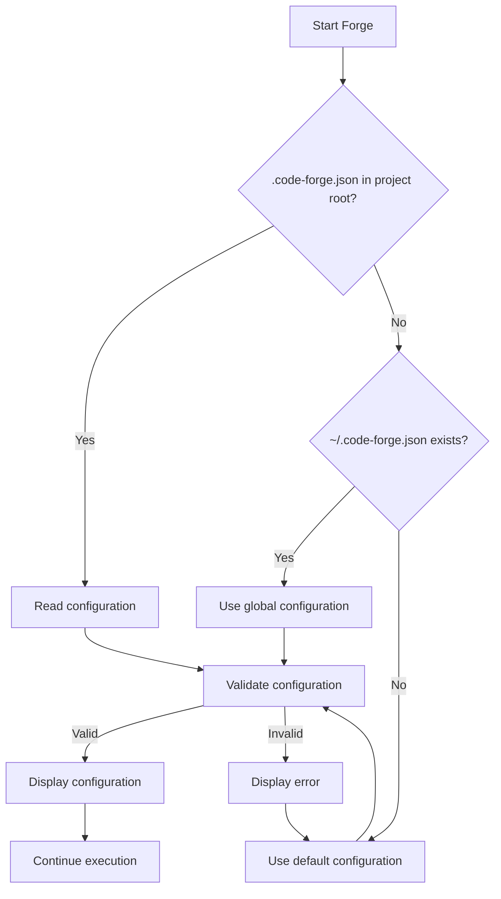

# Code Forge Directory Design Guide

## Problem

The original design used the `docs/` directory, but there are issues:
- ❌ Most projects already use `docs/` for project documentation
- ❌ May conflict with existing documentation structure
- ❌ Confuses "project documentation" and "planning documentation"

## Solution

### Option 1: Use Separate Directory (Default, Recommended) ⭐⭐⭐

Use `planning/` as the working directory for Code Forge:

```
project/
├── docs/              # Existing project documentation (unchanged)
│   ├── api/
│   └── guides/
│
├── planning/          # Code Forge working directory
│   ├── features/      # Input: feature documentation
│   └── implementation/  # Output: implementation planning
│
├── src/
└── tests/
```

**Advantages:**
- ✅ No conflict with `docs/`
- ✅ Clear distinction between "project documentation" and "planning documentation"
- ✅ Generic name without tool traces
- ✅ Selective commit option

**When to use:**
- Most projects (recommended)
- `docs/` is already occupied
- Want clear separation between planning and documentation

### Option 2: Use Configuration File (Flexible) ⭐⭐

Create `.code-forge.json` in the project root:

```json
{
  "directories": {
    "base": "your-directory/",
    "input": "input-subdirectory/",
    "output": "output-subdirectory/"
  }
}
```

**Advantages:**
- ✅ Fully customizable
- ✅ Adapts to any project structure
- ✅ Team can use unified configuration

**When to use:**
- Have special directory structure requirements
- Team has unified standards
- Need to integrate with existing tools

### Option 3: Use docs Subdirectory ⭐

If your `docs/` has no conflicts:

```json
// .code-forge.json
{
  "directories": {
    "base": "docs/",
    "input": "specs/",
    "output": "implementation/"
  }
}
```

**Result:**
```
project/
└── docs/
    ├── api/              # Existing documentation
    ├── specs/            # Forge input
    └── implementation/   # Forge output
```

**Advantages:**
- ✅ Centralized under `docs/`
- ✅ Easy to organize

**Disadvantages:**
- ⚠️ May conflict with existing structure
- ⚠️ Confuses different types of documentation

## Directory Naming Comparison

| Directory | Advantages | Disadvantages | Rating |
|-----------|-----------|----------------|--------|
| `planning/` | Generic, clear | - | ⭐⭐⭐ |
| `dev/` | Short | May conflict with other dev files | ⭐⭐ |
| `implementation/` | Explicit | Longer name | ⭐⭐ |
| `.forge/` | Hidden | Tool-specific traces | ⭐ |
| `.dev/` | Hidden, short | Hidden files not easily discovered | ⭐ |
| `docs/` | Traditional | Easy to conflict | ❌ |

## Configuration Detection Flow



## Configuration Examples

### Personal Project (Recommended)

```json
{
  "directories": {
    "base": "planning/",
    "input": "features/",
    "output": "implementation/"
  },
  "git": {
    "commit_state_file": false,
    "gitignore_patterns": ["**/state.json"]
  }
}
```

**Use cases:**
- Personal development
- Quick iteration
- No need to share state with team

### Team Project

```json
{
  "directories": {
    "base": "planning/",
    "input": "features/",
    "output": "implementation/"
  },
  "git": {
    "commit_state_file": true,
    "gitignore_patterns": []
  }
}
```

**Use cases:**
- Team collaboration
- Need to share progress
- Multiple people assigning tasks

### Using docs Subdirectory

```json
{
  "directories": {
    "base": "docs/",
    "input": "feature-specs/",
    "output": "feature-plans/"
  }
}
```

**Use cases:**
- `docs/` has no conflicts
- Want to centralize under docs
- Project documentation is minimal

### Fully Custom

```json
{
  "directories": {
    "base": "",
    "input": "requirements/features/",
    "output": "development/tasks/"
  }
}
```

**Use cases:**
- Special project structure
- Need to integrate with existing tools
- Company standards require it

## Migration Guide

### Migrating from deep-*

If you previously used deep-* with many `claude-*.md` files:

```bash
# 1. Create new directory structure
mkdir -p planning/features
mkdir -p planning/implementation

# 2. Move valuable documentation
# Extract core content from claude-plan.md
cp 01-foundation/claude-plan.md planning/implementation/foundation/plan.md

# 3. Delete temporary files
rm -rf 01-foundation/sections/
rm -rf 01-foundation/reviews/
rm 01-foundation/claude-*.md

# 4. Create configuration
cat > .code-forge.json <<'EOF'
{
  "directories": {
    "base": "planning/"
  }
}
EOF

# 5. Commit
git add planning/ .code-forge.json
git commit -m "docs: migrate to Code Forge structure"
```

### Migrating from superpowers

If you're using superpowers' `docs/plans/`:

```bash
# 1. Create configuration
cat > .code-forge.json <<'EOF'
{
  "directories": {
    "base": "docs/",
    "input": "features/",
    "output": "plans/"
  }
}
EOF

# 2. Reorganize files (if needed)
# superpowers: docs/plans/2025-02-13-feature.md
# Code Forge:  docs/plans/feature/plan.md

# 3. Continue using Forge
/forge @planning/features/new-feature.md
```

## Git Workflow Recommendations

### Commit Strategy 1: Commit Everything (Team Collaboration)

```bash
# .gitignore
# (exclude no Forge files)

# Commit
git add planning/
git commit -m "docs: add implementation plan for feature-x"
```

**Advantages:**
- Team can see progress
- History is traceable
- Facilitates collaboration

**Disadvantages:**
- `state.json` changes frequently
- More Git history

### Commit Strategy 2: Commit Plans Only (Personal Project)

```bash
# .gitignore
**/state.json

# Commit
git add planning/
git commit -m "docs: add implementation plan for feature-x"
```

**Advantages:**
- Keep planning documentation
- Reduce Git noise
- Personal flexibility

### Commit Strategy 3: Ignore All (Private Planning)

```bash
# .gitignore
planning/

# Don't commit any Forge files
```

**Advantages:**
- Planning process is private
- Clean Git history

**Disadvantages:**
- Not visible to team
- History is not traceable

## FAQ

### Q: What is the default directory?

A: `planning/` (if no configuration file exists)

### Q: How do I change the default directory?

A: Create `.code-forge.json`:
```json
{
  "directories": {
    "base": "your-directory/"
  }
}
```

### Q: What if `docs/` is already occupied?

A: Use the default `planning/` (recommended) or customize another directory

### Q: Should the configuration file be committed?

A: It's recommended to commit it so the team uses a unified directory structure

### Q: How do I temporarily ignore configuration?

A: Use the `--ignore-config` parameter:
```
/forge @xxx.md --ignore-config
```

### Q: Where should the configuration file be placed?

A:
1. Project configuration: `.code-forge.json` in project root (higher priority)
2. Global configuration: `~/.code-forge.json` (default for all projects)

### Q: How do I know which configuration is currently being used?

A: Forge displays it on startup:
```
📋 Code Forge Configuration
├── Base directory: planning/
├── Input directory: planning/features/
├── Output directory: planning/implementation/
└── Configuration source: .code-forge.json (project)
```

## Best Practices

### ✅ Recommended

1. **Use `planning/` as the default directory**
   - Clear, generic, no conflicts

2. **Commit the configuration file**
   - Unified team structure

3. **Choose an appropriate Git strategy**
   - Team projects: commit all files
   - Personal projects: ignore state.json

4. **Create configuration early in the project**
   - Avoid late-stage migration

### ❌ Not Recommended

1. **Don't use directory names with tool traces**
   - ❌ `.forge/`
   - ❌ `claude-dev/`
   - ❌ `ai-plans/`

2. **Don't use directories that may conflict**
   - ❌ `src/`
   - ❌ `node_modules/`
   - ❌ `build/`

3. **Don't change configuration frequently**
   - Causes file dispersion
   - Team confusion

## Summary

| Option | Directory | Use Case | Rating |
|--------|-----------|----------|--------|
| Default | `planning/` | Most projects | ⭐⭐⭐ |
| Configuration | Custom | Special needs | ⭐⭐ |
| docs subdirectory | `docs/xxx/` | docs not conflicting | ⭐ |

**Final recommendation: Use the default `planning/` directory - simple, clear, and no conflicts.**
