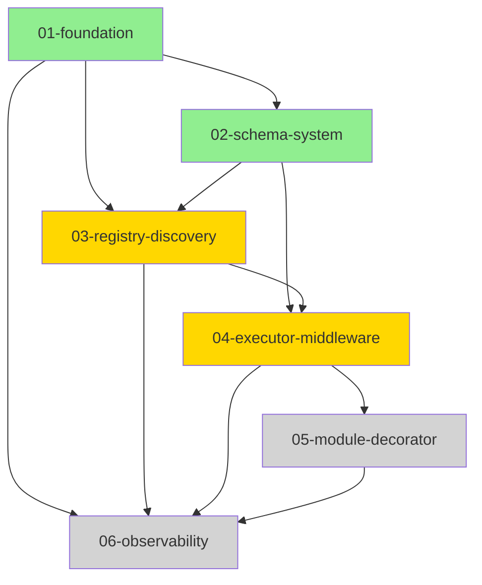

# APCore Python Implementation Overview

> APCore Python framework plan, module relationships, and progress tracking

## Project Information

- **Project name**: APCore Python
- **Goal**: Build a modular Python application framework
- **Tech stack**: Python 3.11+, FastAPI, SQLAlchemy
- **Start date**: 2025-02-10
- **Target completion**: 2025-04-30
- **Current status**: 🔄 In progress

## Overall Progress

```
Overall progress: ████████████░░░░░░ 60%

Completed: 3/6 modules
In progress: 2/6 modules
Not started: 1/6 modules
```

## Module Overview

| Module | Description | Priority | Status | Progress | Owner |
|------|------|--------|------|------|--------|
| [01-foundation](./implementation/01-foundation/) | Infrastructure and core abstractions | P0 | ✅ Completed | 100% | - |
| [02-schema-system](./implementation/02-schema-system/) | Schema definitions and validation | P0 | ✅ Completed | 100% | - |
| [03-registry-discovery](./implementation/03-registry-discovery/) | Service registry and discovery | P0 | 🔄 In progress | 75% | - |
| [04-executor-middleware](./implementation/04-executor-middleware/) | Executor and middleware system | P0 | 🔄 In progress | 40% | - |
| [05-module-decorator](./implementation/05-module-decorator/) | Module decorators and binding | P1 | ⏸️ Not started | 0% | - |
| [06-observability](./implementation/06-observability/) | Observability and integrations | P1 | ⏸️ Not started | 0% | - |

## Module Dependencies

### Dependency Graph



**Legend:**
- 🟢 Green - Completed
- 🟡 Yellow - In progress
- ⚪ Gray - Not started

### Dependency Details

#### 01-foundation (Foundation layer)
- **No dependencies** - lowest-level module
- **Provides**:
  - Pattern base class
  - IDConverter utilities
  - ModuleABC abstraction
  - Context
  - Configuration system

#### 02-schema-system (Schema layer)
- **Depends on**: 01-foundation
- **Provides**:
  - Schema definitions
  - Data validation
  - Type conversion

#### 03-registry-discovery (Registry layer)
- **Depends on**: 01-foundation, 02-schema-system
- **Provides**:
  - Service registry
  - Service discovery mechanism
  - Dependency injection container

#### 04-executor-middleware (Execution layer)
- **Depends on**: 02-schema-system, 03-registry-discovery
- **Provides**:
  - Executor system
  - Middleware chain
  - Request processing pipeline

#### 05-module-decorator (Decorator layer)
- **Depends on**: 04-executor-middleware
- **Provides**:
  - Module decorators
  - Auto binding
  - Configuration injection

#### 06-observability (Observability layer)
- **Depends on**: 01-foundation, 03-registry-discovery, 04-executor-middleware, 05-module-decorator
- **Provides**:
  - Logging system
  - Metrics collection
  - Tracing
  - Health checks

## Recommended Implementation Order

### Phase 1: Infrastructure (Completed ✅)

```
01-foundation
  ├── ✅ Task 1: Project scaffolding
  ├── ✅ Task 2: Error handling system
  ├── ✅ Task 3: Pattern base class
  ├── ✅ Task 4: IDConverter utility
  ├── ✅ Task 5: ModuleABC abstraction
  ├── ✅ Task 6: Context
  ├── ✅ Task 7: Configuration system
  └── ✅ Task 8: Public API exports
```

**Completion criteria:** ✅
- [x] Project structure complete
- [x] All foundational classes implemented
- [x] Test coverage >= 85%
- [x] Documentation complete

---

### Phase 2: Schema system (Completed ✅)

```
02-schema-system
  ├── ✅ Task 1: Schema foundations
  ├── ✅ Task 2: Validator implementation
  ├── ✅ Task 3: Type conversion
  └── ✅ Task 4: Schema composition
```

**Completion criteria:** ✅
- [x] Schema definitions complete
- [x] Validation logic correct
- [x] Test coverage >= 80%

---

### Phase 3: Registry and discovery (In progress 🔄)

```
03-registry-discovery
  ├── ✅ Task 1: Registry basics
  ├── ✅ Task 2: Service registration
  ├── 🔄 Task 3: Service discovery
  └── ⏸️ Task 4: Dependency injection
```

**Current status:** 75% complete
- [x] Registry implementation complete
- [x] Service registration mechanism complete
- [ ] Service discovery optimization in progress
- [ ] Dependency injection pending

---

### Phase 4: Executor and middleware (In progress 🔄)

```
04-executor-middleware
  ├── 🔄 Task 1: Executor basics
  ├── ⏸️ Task 2: Middleware chain
  ├── ⏸️ Task 3: Request handling
  └── ⏸️ Task 4: Error handling integration
```

**Current status:** 40% complete
- [ ] Executor basics implementation in progress
- [ ] Middleware system design in progress
- [ ] Waiting on 03 completion

---

### Phase 5: Module decorators (Not started ⏸️)

```
05-module-decorator
  ├── ⏸️ Task 1: Decorator design
  ├── ⏸️ Task 2: Auto binding
  ├── ⏸️ Task 3: Configuration injection
  └── ⏸️ Task 4: Metadata collection
```

**Blocked by:** Waiting for 04-executor-middleware completion

---

### Phase 6: Observability (Not started ⏸️)

```
06-observability
  ├── ⏸️ Task 1: Logging system
  ├── ⏸️ Task 2: Metrics collection
  ├── ⏸️ Task 3: Tracing
  └── ⏸️ Task 4: Health checks
```

**Blocked by:** Other modules must complete

## Milestones

### M1: Foundation ready ✅ (2025-02-15)
- ✅ 01-foundation complete
- ✅ Project runnable
- ✅ Test framework ready

### M2: Schema system complete ✅ (2025-02-28)
- ✅ 02-schema-system complete
- ✅ Data validation available

### M3: Core service layer complete 🔄 (2025-03-15)
- 🔄 03-registry-discovery complete
- 🔄 04-executor-middleware complete
- ⏸️ Basic request handling available

### M4: Full framework ⏸️ (2025-04-15)
- ⏸️ 05-module-decorator complete
- ⏸️ All core features available

### M5: Production ready ⏸️ (2025-04-30)
- ⏸️ 06-observability complete
- ⏸️ Documentation complete
- ⏸️ Example project complete

## Critical Path Analysis

**Critical path:**
```
01-foundation → 02-schema-system → 04-executor-middleware → 05-module-decorator
```

**Parallel paths:**
```
03-registry-discovery can be developed in parallel with parts of 04
06-observability depends on multiple modules and should be integrated last
```

**Current bottlenecks:**
- Service discovery in 03-registry-discovery
- Middleware design in 04-executor-middleware

## Risks and Mitigation

| Risk | Impact | Probability | Current status | Mitigation |
|------|------|------|---------|---------|
| Inter-module interfaces unstable | High | Medium | 🔄 Monitoring | Detailed interface docs, integration tests |
| Performance below target | High | Low | ⏸️ Pending verification | Benchmarks, profiling |
| Test coverage slipping | Medium | Medium | ⚠️ Needs attention | Enforce coverage in CI/CD |
| Documentation lag | Medium | High | ⚠️ Needs improvement | Include doc updates in each task |

## Quality Metrics

### Test Coverage

| Module | Unit tests | Integration tests | Total coverage | Target | Status |
|------|---------|---------|---------|------|------|
| 01-foundation | 92% | 88% | 90% | >= 85% | ✅ |
| 02-schema-system | 88% | 85% | 87% | >= 80% | ✅ |
| 03-registry-discovery | 75% | 70% | 73% | >= 80% | ⚠️ |
| 04-executor-middleware | 60% | - | 60% | >= 80% | ⚠️ |
| 05-module-decorator | - | - | - | >= 80% | - |
| 06-observability | - | - | - | >= 80% | - |

### Code Quality

| Module | Ruff | MyPy | Complexity | Status |
|------|------|------|--------|------|
| 01-foundation | ✅ 0 | ✅ 0 | Low | ✅ |
| 02-schema-system | ✅ 0 | ✅ 0 | Low | ✅ |
| 03-registry-discovery | ⚠️ 2 | ✅ 0 | Medium | ⚠️ |
| 04-executor-middleware | 🔄 - | 🔄 - | - | 🔄 |

## Documentation Links

### Implementation Plans
- [01-foundation](./implementation/01-foundation/plan.md)
- [02-schema-system](./implementation/02-schema-system/plan.md)
- [03-registry-discovery](./implementation/03-registry-discovery/plan.md)
- [04-executor-middleware](./implementation/04-executor-middleware/plan.md)
- [05-module-decorator](./implementation/05-module-decorator/plan.md)
- [06-observability](./implementation/06-observability/plan.md)

### Design Docs
- [Architecture design](../docs/architecture/design.md)
- [API reference](../docs/api/)

## Current Focus

### This Week
1. **Complete service discovery in 03-registry-discovery**
  - Implement service lookup logic
  - Add caching
  - Integration tests

2. **Advance 04-executor-middleware**
  - Finish executor basics
  - Design middleware interfaces
  - Write unit tests

### Next Week
1. Complete 03-registry-discovery
2. Complete 04-executor-middleware tasks 1-2
3. Start 05-module-decorator design

## Change Log

### 2025-03-05
- 03-registry-discovery progress updated to 75%
- 04-executor-middleware implementation started

### 2025-02-28
- 02-schema-system completed
- M2 milestone reached

### 2025-02-15
- 01-foundation completed
- M1 milestone reached

### 2025-02-10
- Project started
- Planning document created

---

**Last updated**: 2025-03-05
**Updated by**: Development Team
