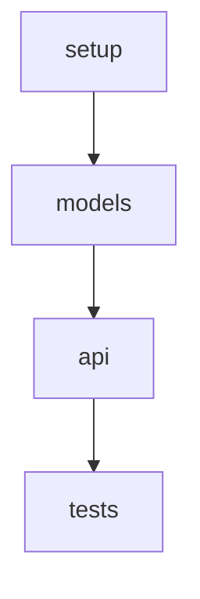

# Code Forge - Documentation to Implementation

Forge executable development plans from documentation, combining deep-* thoroughness with superpowers organization.

## When to Use

✅ Have existing requirements/design documentation that needs to be broken down into development tasks
✅ Need team collaboration with plans committed to Git
✅ Need to track development progress (pending, in_progress, completed)
✅ Need iterative development with pause/resume support

## Workflow

```
Input Document → Analysis → Planning → Task Breakdown → Execution → Status Tracking
```

## How to Use

### 0. View All Features (No Arguments)
```bash
# Run without arguments to see all features and their status
/forge
```

### 1. Start from Documentation
```bash
# Method A: Specify existing document
/forge @docs/features/user-auth.md

# Method B: Create document first
1. Create docs/features/{feature-name}.md
2. /forge @docs/features/{feature-name}.md
```

### 2. Forge Execution Flow

#### Phase 1: Analyze the document
- Read the source document
- Understand requirements and technical needs
- Identify dependencies and constraints

#### Phase 2: Ask for additional information
Use `AskUserQuestion` to ask:
- Technology stack preferences (if not specified)
- Testing strategy
- Deployment considerations
- Priority

#### Phase 3: Generate implementation plan
Create the directory structure:
```
docs/implementation/features/{feature-name}/
├── overview.md
├── plan.md
├── tasks/
└── state.json
```

#### Phase 4: Task breakdown
- Break down using TDD
- Each task includes: test → implement → verify
- Generate standalone task files

#### Phase 5: Execution choice
Ask the user how to proceed:
1. **Execute now** - run tasks in the current session
2. **Execute later** - save the plan and run manually later
3. **Team collaboration** - assign tasks across teammates

## File Organization

### Directory Structure
```
docs/
├── features/                       # Input: feature documents
│   └── user-auth.md
└── implementation/                 # Output: implementation plans
    └── features/
        └── user-auth/
            ├── overview.md         # Feature overview + task execution order
            ├── plan.md             # Overall plan
            ├── tasks/              # Task breakdown
            │   ├── setup.md
            │   ├── models.md
            │   ├── api.md
            │   └── tests.md
            └── state.json          # Status tracking
```

### Naming Conventions
- Feature directories: kebab-case (`user-auth`, `payment-gateway`)
- Task files: `{description}.md` (`setup.md`, `models.md`)
- Execution order is defined in `overview.md` and `state.json`, not in filenames
- No "claude-" or tool prefixes
- Suitable for Git commits

## Status Tracking

### state.json Format
```json
{
  "feature": "user-auth",
  "status": "in_progress",
  "execution_order": ["setup", "models", "api", "tests"],
  "progress": {
    "total_tasks": 4,
    "completed": 1,
    "in_progress": 1,
    "pending": 2
  },
  "tasks": [
    {
      "id": "setup",
      "title": "Project setup and dependencies",
      "status": "completed",
      "started_at": "2025-02-13T10:00:00Z",
      "completed_at": "2025-02-13T11:00:00Z"
    },
    {
      "id": "models",
      "title": "Data model implementation",
      "status": "in_progress",
      "started_at": "2025-02-13T11:30:00Z"
    }
  ]
}
```

### Status Definitions
- `pending` - pending
- `in_progress` - in progress
- `completed` - completed
- `blocked` - blocked
- `skipped` - skipped

## Task Execution

### Execute a Single Task
1. Read the task file `tasks/{name}.md`
2. Follow the TDD steps:
  - Write tests
  - Run tests (confirm failure)
  - Implement code
  - Run tests (confirm pass)
  - Commit code
3. Update `state.json` status
4. Ask: continue to next or pause

### Pause/Resume
- You can stop at any time
- `state.json` records current progress
- Run `/forge` to see all features and select one to resume
- Or run `/forge @feature` to directly resume a specific feature

## Detailed Implementation Steps

### Step 0: Configuration Detection and Loading

**Important:** Detect and load configuration before any operation.

#### 0.1 Detect Project Root

Search upward for project root markers:
```bash
# Marker files (any language/framework)
.git/
.code-forge.json
pyproject.toml
package.json
Cargo.toml
go.mod
build.gradle
pom.xml
Makefile
```

If no root is found, use the current directory as the project root.

#### 0.2 Load Configuration (three-layer merge)

Load configuration by priority:

**Configuration loading algorithm:**

1. **System defaults** - Start with built-in defaults:
   - `directories.base` = `"planning/"`
   - `directories.input` = `"features/"`
   - `directories.output` = `"implementation/"`
   - `git.auto_commit` = `false`
   - `git.commit_state_file` = `true`
   - `git.gitignore_patterns` = `[]`
   - `execution.default_mode` = `"ask"`
   - `execution.auto_tdd` = `true`
   - `execution.task_granularity` = `"medium"`

2. **User global configuration** (if `~/.code-forge.json` exists):
   - Read and parse the JSON file
   - Deep-merge into defaults (user values override defaults)

3. **Project configuration** (highest priority, if `<project_root>/.code-forge.json` exists):
   - Read and parse the JSON file
   - Deep-merge into current config (project values override everything)

#### 0.3 Validate Configuration

**Configuration validation rules:**

1. **Directory path safety:**
   - `directories.base` must NOT contain `..` (security risk)
   - `directories.base` must NOT be a system/source directory (e.g., `src/`, `node_modules/`, `build/`, `.git/`)

2. **Field type validation:**
   - `git.commit_state_file` must be a boolean (not a string like `"true"`)
   - `execution.default_mode` must be one of: `"ask"`, `"manual"`, `"auto"`

3. **On validation failure:**
   - Display all errors with descriptions
   - Continue with system defaults

If there are errors, show them and use defaults:
```
❌ Configuration validation failed

Errors:
  - directories.base cannot contain '..'
  - git.commit_state_file must be boolean

Continuing with system defaults
```

#### 0.4 Show Final Configuration

Show the configuration that will be used:

```
📋 Code Forge Configuration
├── Base directory: planning/
├── Input directory: planning/features/
├── Output directory: planning/implementation/
├── Configuration sources:
│   ├── System defaults: ✓
│   ├── User configuration: ~/.code-forge.json ✓
│   └── Project configuration: .code-forge.json ✓
└── Final priority: project configuration

Files will be created at:
  {base_dir}/{output_dir}/{feature_name}/

Continue?
```

#### 0.5 Handle Configuration Errors

**Scenario 1: Configuration file not found**
```
ℹ️  Configuration file not found, using defaults

Default configuration:
- Base directory: planning/
- Input directory: planning/features/
- Output directory: planning/implementation/

To customize, create .code-forge.json
See: /path/to/CONFIGURATION.md
```

**Scenario 2: Invalid configuration file format**
```
❌ Configuration file format error

File: .code-forge.json
Error: JSON parse failed at line 5
      Unexpected token ','

Suggestions:
1. Check JSON syntax (commas, quotes, brackets)
2. Validate with jsonlint.com
3. Reference template: templates/.code-forge.json

Continuing with system defaults
```

**Scenario 3: Invalid configuration values**
```
⚠️  Configuration validation warning

Issues:
- directories.base is set to "src/"
- This is typically a source directory and is not recommended for planning files

Suggestions:
- Use "planning/" (recommended)
- Use "dev-plans/"
- Use "docs/implementation/"

Continue with current configuration?
  - Yes, use "src/" (not recommended)
  - No, use default "planning/"
```

#### 0.6 Store Configuration Context

After configuration is loaded and validated, track these resolved values for use in subsequent steps:

- `config` - The final merged configuration object
- `project_root` - The detected project root path
- `base_dir` - Resolved path: `<project_root>/<config.directories.base>`
- `input_dir` - Resolved path: `<base_dir>/<config.directories.input>`
- `output_dir` - Resolved path: `<base_dir>/<config.directories.output>`

---

### Step 0.7: Handle No-Argument Invocation (Feature Dashboard)

When `/forge` is called **without arguments**, display a dashboard of all features:

#### 0.7.1 Scan for Features

1. Resolve the output directory: `<base_dir>/<output_dir>/`
2. Search for all `state.json` files under that directory (one level deep: `<output_dir>/*/state.json`)
3. For each `state.json` found, read and extract:
   - `feature` (feature name)
   - `status` (overall status)
   - `progress.total_tasks`, `progress.completed`, `progress.in_progress`, `progress.pending`
   - `metadata.source_doc` (original input document path)
   - `updated` (last updated timestamp)

#### 0.7.2 Display Feature Dashboard

**Scenario A: Features found**
```
📋 Code Forge - Feature Dashboard

| # | Feature | Progress | Status | Last Updated |
|---|---------|----------|--------|--------------|
| 1 | user-auth | 2/4 tasks (50%) | 🔄 In Progress | 2025-03-05 |
| 2 | payment | 0/3 tasks (0%) | ⏸️ Pending | 2025-03-01 |
| 3 | file-upload | 5/5 tasks (100%) | ✅ Completed | 2025-02-28 |

Select an action:
  - Enter a number to continue that feature (e.g., "1" for user-auth)
  - New feature - start from a document
  - Exit
```

**Scenario B: No features found**
```
📋 Code Forge - Feature Dashboard

No features found in {output_dir}/

Get started:
  1. Create a feature document at {base_dir}/{input_dir}/{feature-name}.md
  2. Run: /forge @{base_dir}/{input_dir}/{feature-name}.md

Or specify an existing document:
  /forge @path/to/your-feature.md
```

#### 0.7.3 Handle User Selection

- **User selects a number** → Read that feature's `state.json`, enter **resume mode** (same as Step 1.5 Scenario A)
- **User selects "New feature"** → Ask for the document path using `AskUserQuestion`, then proceed to Step 1
- **User selects "Exit"** → End

---

### Step 1: Validate Input Document

#### 1.1 Check Document Path

User should provide an @file path:
```bash
/forge @planning/features/user-auth.md
```

**Note:** Use configured path (`{base_dir}/{input_dir}/`)

#### 1.2 Handle Missing Document

If no document is provided and dashboard was not shown (e.g., invoked with invalid arguments):

```
❌ Code Forge requires a feature document as input

Please provide an existing document path:
  /forge @{base_dir}/{input_dir}/your-feature.md

Or create a document first:
  1. Create {base_dir}/{input_dir}/{feature-name}.md
  2. Describe requirements and design in the document
  3. /forge @{base_dir}/{input_dir}/{feature-name}.md

Example:
  /forge @planning/features/user-auth.md

Or run without arguments to see all features:
  /forge

Configuration details:
  Current configuration: base_dir={base_dir}, input_dir={input_dir}
  To change configuration, edit .code-forge.json
```

#### 1.3 Validate Document

**Input document validation checks:**

Perform these checks on the provided document path:

1. **File exists** - If not found, report "File not found" with the full path and suggest checking the file path
2. **File is not empty** - If empty, report "File is empty" and suggest adding requirements and design content
3. **File is Markdown** - If not `.md` extension, warn "Not a Markdown file" and ask whether to continue processing as plain text

#### 1.4 Handle Document Errors

**Error 1: File not found**
```
❌ Input document not found

File: planning/features/user-atuh.md  (note the typo)
      ~~~~~~~~~~~~~~~~~~~~^

Suggestions:
1. Check filename spelling
2. Confirm file path
3. View available files:

planning/features/
├── user-auth.md  ← Did you mean this?
├── payment.md
└── file-upload.md

Create a new document? (y/n)
```

**Error 2: File is empty**
```
❌ Input document is empty

File: planning/features/user-auth.md

Please add the following to the document:
1. Requirements
2. Feature description
3. Technical requirements (optional)

Minimal example:
```markdown
# User Authentication

## Requirements
Implement user login and registration

## Technology
Use your preferred web framework + authentication library
```

Re-run after editing:
  /forge @planning/features/user-auth.md
```

**Error 3: Wrong format**
```
⚠️  File format warning

File: planning/features/user-auth.txt
Format: .txt

Code Forge expects a Markdown file (.md)

Continue?
  - Yes, process as plain text
  - No, cancel
```

#### 1.5 Detect Existing Plan

**Existing plan detection logic:**

Check whether the output directory already exists:
- Resolve the output path: `<output_dir>/<feature_name>`
- If the directory exists:
  - If `state.json` exists inside: Enter **resume mode** (read state, display progress, ask how to proceed)
  - If `state.json` does NOT exist: Enter **conflict mode** (warn about existing files, offer backup/overwrite/cancel)

**Scenario A: Resume mode (with state.json)**
```
✓ Existing plan detected

Feature: user-auth
Status: in_progress
Progress: 2/4 tasks completed

  ✅ setup        - Completed
  ✅ models       - Completed
  🔄 api          - In progress (60%)
  ⏸️  tests        - Pending

How to proceed?
  - Continue (recommended) - resume from current progress
  - Restart - delete all files and regenerate
  - View plan - open plan.md
  - Cancel
```

**Scenario B: Directory conflict (no state.json)**
```
⚠️  Target directory already exists

Directory: planning/implementation/user-auth/
Files:
  - plan.md (36KB, modified 2 days ago)
  - overview.md (2KB, modified 2 days ago)
  - tasks/ (3 files)

This may be:
1. Manually created files
2. Previously generated but state.json deleted
3. Filename conflict

How to proceed?
  - Backup and overwrite - move to .backup/ then regenerate
  - Force overwrite - overwrite directly (dangerous)
  - Cancel - handle manually then rerun
```

### Step 2: Analyze Document Content

Analyze the following:
1. **Feature Name** - Extract from filename or title
2. **Technical Requirements** - Identify mentioned tech stack, frameworks
3. **Functional Scope** - Understand what needs to be implemented
4. **Constraints** - Performance, security, compatibility requirements
5. **Testing Requirements** - Check if testing strategy is mentioned

### Step 3: Ask for Additional Information

If not clearly specified in document, use `AskUserQuestion` to ask:

**Question 1: Technology Stack Confirmation**
```
question: "Confirm Technology Stack Selection"
options:
  - label: "Use {extracted_tech} mentioned in document"
    description: "Continue with technology specified in document"
  - label: "Use existing project tech stack"
    description: "Analyze project code, use existing frameworks and patterns"
  - label: "Custom"
    description: "I will specify technology choices"
```

**Question 2: Testing Strategy**
```
question: "Testing Strategy Preference"
options:
  - label: "Strict TDD (Recommended)"
    description: "Write tests first for each task, then implement code"
  - label: "Tests After"
    description: "Implement features first, write tests at the end"
  - label: "Minimal Testing"
    description: "Test only core logic"
```

**Question 3: Task Granularity**
```
question: "Task Breakdown Granularity"
options:
  - label: "Fine-grained (5-10 tasks)"
    description: "Each task 1-2 hours, easier to track"
  - label: "Medium-grained (3-5 tasks)"
    description: "Each task half day, balance detail and quantity"
  - label: "Coarse-grained (2-3 tasks)"
    description: "Each task 1-2 days, quick start"
```

### Step 4: Create Directory Structure

**Feature name extraction:**

Extract the feature name from one of these sources:
- **From filename:** `user-authentication.md` yields `"user-authentication"`
- **From document title:** `"# User Authentication System"` yields `"user-authentication"` (convert to kebab-case)

Create directory:
```
{output_dir}/{feature_name}/
├── overview.md
├── plan.md
├── tasks/
└── state.json
```

Confirm with user:
```
Will create implementation plan at:
  {output_dir}/{feature_name}/

Continue?
```

### Step 5: Generate overview.md

Generate feature overview based on document content:

```markdown
# {Feature Name}

## Overview
[Extract or summarize from source document]

## Scope
**Included:**
- [Feature point 1]
- [Feature point 2]

**Excluded:**
- [Clearly excluded content]

## Technology Stack
- Language/Framework: {tech}
- Key Dependencies: {dependencies}
- Testing Tools: {test_framework}

## Task Execution Order

| # | Task File | Description | Status |
|---|-----------|-------------|--------|
| 1 | [setup.md](./tasks/setup.md) | Project setup and dependencies | pending |
| 2 | [models.md](./tasks/models.md) | Data model implementation | pending |
| 3 | [api.md](./tasks/api.md) | API endpoint implementation | pending |
| 4 | [tests.md](./tasks/tests.md) | Integration testing | pending |

## Progress
- Total Tasks: {total}
- Completed: {completed}
- In Progress: {in_progress}
- Pending: {pending}

## Reference Documents
- [Source Requirements Document]({source_doc})
```

### Step 6: Generate plan.md

Create detailed implementation plan:

```markdown
# {Feature Name} Implementation Plan

## Goal
[One sentence describing what to implement]

## Architecture Design

### Component Structure
[Describe main components and their relationships]

### Data Flow
[Describe how data flows]

### Technical Choices
- **Language/Framework**: {tech}
  Reason: [Why choose this]

- **Key Libraries**: {libraries}
  Reason: [Why need these libraries]

## Task Breakdown

### Overview


### Task List
- [ ] **setup** - Project setup and dependency installation
  - Estimated Time: 1-2 hours
  - Dependencies: None

- [ ] **models** - Data model implementation
  - Estimated Time: 2-3 hours
  - Dependencies: setup

- [ ] **api** - API endpoint implementation
  - Estimated Time: 3-4 hours
  - Dependencies: models

- [ ] **tests** - Integration testing
  - Estimated Time: 2-3 hours
  - Dependencies: api

## Risks and Considerations
[Identified technical challenges, risks]

## Acceptance Criteria
- [ ] All unit tests pass
- [ ] Integration tests pass
- [ ] Code review passed
- [ ] Documentation complete
- [ ] Performance meets requirements

## References
- [Related technical documentation]
- [Related code examples]
```

### Step 7: Task Breakdown

Create a detailed file for each task `tasks/{name}.md`:

**Principles:**
- TDD first: test → implement → verify
- Concrete steps: include complete code examples
- Clear commands: include expected output
- Traceable: annotate dependencies

**Example: tasks/setup.md**
```markdown
# Task: Project setup and dependencies

## Goal
Set up project structure, install required dependencies, configure dev environment

## Files Involved
- Create: dependency manifest (e.g., `package.json`, `requirements.txt`, `Cargo.toml`, `go.mod`)
- Create: test configuration (e.g., `jest.config.js`, `pytest.ini`, test section in build config)
- Create: `.env.example`
- Update: `.gitignore`

## Steps

### 1. Create dependency file
Create the project's dependency manifest with the chosen framework and libraries.
Include both runtime dependencies and development/testing dependencies.

### 2. Configure test framework
Configure the project's test runner with:
- Test directory location
- Test file naming pattern
- Coverage settings
- Any necessary plugins

### 3. Create project structure
```bash
mkdir -p src/{feature_module}
mkdir -p tests/{feature_module}
```
Add any language-specific initialization files as needed.

### 4. Verify setup
Install dependencies using the project's package manager.
Run the test suite to verify it detects tests (even if none pass yet).

### 5. Commit
```bash
git add .
git commit -m "chore: setup project structure and dependencies"
```

## Acceptance Criteria
- [ ] Dependencies installed successfully
- [ ] Test runner executes
- [ ] Project structure created
- [ ] Git commit completed

## Dependencies
- Depends on: none
- Required by: models

## Estimated Time
1-2 hours
```

### Step 8: Initialize Status

Create `state.json`:

```json
{
  "feature": "{feature_name}",
  "created": "{current_iso_timestamp}",
  "updated": "{current_iso_timestamp}",
  "status": "pending",
  "execution_order": ["setup", "models", "api", "tests"],
  "progress": {
    "total_tasks": 4,
    "completed": 0,
    "in_progress": 0,
    "pending": 4
  },
  "tasks": [
    {
      "id": "setup",
      "file": "tasks/setup.md",
      "title": "Project Setup and Dependencies",
      "status": "pending",
      "started_at": null,
      "completed_at": null,
      "assignee": null,
      "commits": []
    },
    {
      "id": "models",
      "file": "tasks/models.md",
      "title": "Data Model Implementation",
      "status": "pending",
      "started_at": null,
      "completed_at": null,
      "assignee": null,
      "commits": []
    },
    {
      "id": "api",
      "file": "tasks/api.md",
      "title": "API Endpoint Implementation",
      "status": "pending",
      "started_at": null,
      "completed_at": null,
      "assignee": null,
      "commits": []
    },
    {
      "id": "tests",
      "file": "tasks/tests.md",
      "title": "Integration Testing",
      "status": "pending",
      "started_at": null,
      "completed_at": null,
      "assignee": null,
      "commits": []
    }
  ],
  "metadata": {
    "source_doc": "{source_doc_path}",
    "created_by": "code-forge",
    "version": "1.0"
  }
}
```

### Step 9: Display Plan

Output plan summary:
```
✅ Implementation plan generated

📂 Location: {output_dir}/{feature_name}/
📋 Total Tasks: 4
⏱️  Estimated Total Time: 8-12 hours

Task Overview:
  setup       - Project Setup and Dependencies          [pending]
  models      - Data Model Implementation               [pending]
  api         - API Endpoint Implementation             [pending]
  tests       - Integration Testing                     [pending]

View detailed plan:
  cat {output_dir}/{feature_name}/plan.md
```

### Step 10: Ask for Execution Method

Use `AskUserQuestion`:

```
question: "How to execute this plan?"
options:
  - label: "Start Execution Now (Recommended)"
    description: "Execute tasks one by one in current session, automatically track progress"

  - label: "Manual Execution Later"
    description: "Save plan, I will implement manually following task files later"

  - label: "Team Collaboration Mode"
    description: "Multiple people assign tasks, use state.json to track progress"

  - label: "Generate Plan Only"
    description: "Only generate plan files, don't execute"
```

**If selected "Start Execution Now":**
- Enter task execution loop (Step 11)

**If selected "Manual Execution Later":**
- Prompt user how to resume:
  ```
  To resume execution later:
    /forge                                       # View all features, select to continue
    /forge @docs/features/{feature_name}.md      # Directly resume this feature

  Or manually execute tasks:
    1. Read the task files in order listed in overview.md
    2. Follow steps to implement
    3. Manually update state.json
  ```

**If selected "Team Collaboration Mode":**
- Prompt team collaboration guidelines:
  ```
  Team Collaboration Suggestions:
  1. Commit plan to Git
  2. Team members claim tasks (modify assignee in state.json)
  3. Update state.json status after completion
  4. Regularly sync state.json
  ```

### Step 11: Task Execution Loop

If user chooses to execute immediately:

**Task execution loop:**

1. Read `state.json`
2. Find the next task in `execution_order` that is `"pending"` and has no unmet dependencies
3. If no such task exists: display "All tasks completed!" and exit loop
4. Display task information: "Starting task: {id} - {title}"
5. Read the task file from `tasks/{id}.md`
6. Update the task status to `"in_progress"` in `state.json`
7. Execute the task steps (follow TDD: write tests, run tests, implement, verify, commit)
8. Ask the user using `AskUserQuestion`: "Is the task completed?"
   - **"Completed, continue to next"** → update status to `"completed"`, continue loop
   - **"Encountered issue, pause"** → keep `"in_progress"` status, exit loop
   - **"Skip this task"** → update status to `"skipped"`, continue loop
9. Repeat from step 1

### Step 11.5: Verify Generated Files

Before completion summary, verify all files are correctly generated:

#### Verification Checklist

**File generation verification checks:**

1. **Required files exist and are non-empty:**
   - `overview.md` (Feature overview with task execution order)
   - `plan.md` (Implementation plan)
   - `state.json` (Status tracking)

2. **Tasks directory:**
   - `tasks/` directory exists
   - Contains at least one `.md` file
   - Each task file uses a descriptive name (e.g., `setup.md`, not `01-setup.md`)

3. **state.json validity:**
   - Valid JSON format
   - Contains required fields: `feature`, `status`, `tasks`, `execution_order`
   - Task count in `state.json` matches number of task files in `tasks/`
   - All task IDs in `execution_order` correspond to entries in `tasks` array

4. **Content completeness:**
   - `plan.md` contains sections: title heading, `## Goal`, `## Task Breakdown`, `## Acceptance Criteria`
   - `overview.md` contains `## Task Execution Order` table

#### Verification Result Handling

**Scenario A: Verification Passed**
```
✅ File verification passed

Check items:
  ✓ overview.md exists and has content
  ✓ plan.md exists and has content
  ✓ state.json exists and format is correct
  ✓ tasks/ directory contains 4 task files
  ✓ Content structure is complete

Continuing execution...
```

**Scenario B: Has Errors**
```
❌ File verification failed

Errors:
  - Missing plan.md (Implementation plan)
  - tasks/ directory is empty

These files are required, cannot continue.

Possible causes:
1. File generation process interrupted
2. Files accidentally deleted
3. Permission issues

Suggestions:
- Re-run /forge @{input_doc}
- Check file permissions
- View error logs

Regenerate? (y/n)
```

**Scenario C: Has Warnings**
```
⚠️  File verification warnings

Warnings:
  - Task count mismatch: state.json(4) vs tasks/(3)
  - plan.md may be missing section: ## Acceptance Criteria

These are not fatal issues but may affect usage.

Continue?
  - Yes, continue execution (Recommended)
  - No, stop and check manually
  - Ignore warnings
```

#### Auto Fix

For certain issues, attempt automatic repair:

1. **Empty overview.md** → Generate template content from plan data
2. **Missing tasks/ directory** → Create the directory
3. **Missing state.json** → Generate initial state from task files found

Display what was fixed:
```
🔧 Auto-fix

Fixed:
  ✓ overview.md template generated
  ✓ tasks/ directory created

Please re-run verification
```

---

### Step 12: Completion Summary

After all tasks are completed:

```
🎉 Feature implementation completed!

✅ Completed tasks: 4/4
📂 Location: {output_dir}/{feature_name}/
⏱️  Total time: {actual_time}

Next steps:
  [ ] Run complete test suite
  [ ] Code review
  [ ] Update documentation
  [ ] Create Pull Request

Run tests:
  Run the project's test suite to verify all tests pass

Code review:
  /code-review
```

## Resume Execution

Two ways to resume paused work:

### Method 1: Feature Dashboard (Recommended)

Run `/forge` without arguments to see all features:

```
/forge
```

This scans all `state.json` files and shows a dashboard:
```
📋 Code Forge - Feature Dashboard

| # | Feature | Progress | Status | Last Updated |
|---|---------|----------|--------|--------------|
| 1 | user-auth | 2/4 tasks (50%) | 🔄 In Progress | 2025-03-05 |
| 2 | payment | 0/3 tasks (0%) | ⏸️ Pending | 2025-03-01 |

Select an action:
  - Enter a number to continue that feature
  - New feature - start from a document
  - Exit
```

Select the feature number to resume.

### Method 2: Direct Resume

Run `/forge @{feature_doc}` with the original document path:

```
/forge @planning/features/user-auth.md
```

This will:
1. Detect existing planning directory
2. Read `state.json`
3. Display current progress
4. Ask whether to continue

```
Detected existing implementation plan

📂 Feature: {feature_name}
📊 Progress: 2/4 tasks completed

  ✅ setup        - Completed
  ✅ models       - Completed
  🔄 api          - In Progress
  ⏸️  tests        - Pending

Continue execution?
  - Continue current task
  - Restart
  - View plan
  - Exit
```

## Integration with Claude Code Tasks

Optionally, synchronize tasks to Claude Code's Task system:

For each task in the `execution_order`:
- Call `TaskCreate` with:
  - `subject`: `"<task_id>: <task_title>"`
  - `description`: contents of the task file
  - `activeForm`: `"Implementing <task_title>"`

This allows viewing the task list in Claude Code.

## Coordination with Other Skills

### With /brainstorming
```bash
# Brainstorm design first
/brainstorming

# Generate docs/features/xxx-design.md

# Then generate implementation plan based on design
/forge @docs/features/xxx-design.md
```

### With /test-driven-development
```bash
# Execute tasks using TDD skill
/forge @docs/features/xxx.md

# Automatically call TDD skill when executing each task
```

### With /requesting-code-review
```bash
# After all tasks are completed
/requesting-code-review
```

## Notes

1. **Document Quality**: The more detailed the input document, the more accurate the generated plan
2. **Git Commits**: Recommend committing `docs/implementation/` to Git for team visibility
3. **State Files**: `state.json` can be optionally committed or added to .gitignore
4. **Task Granularity**: Recommend 1-3 hours per task for easy tracking
5. **Dependency Management**: Dependencies between tasks affect execution order

## Examples

Complete examples can be found at:
- `examples/user-auth/` - User authentication feature example
- `examples/file-upload/` - File upload feature example
